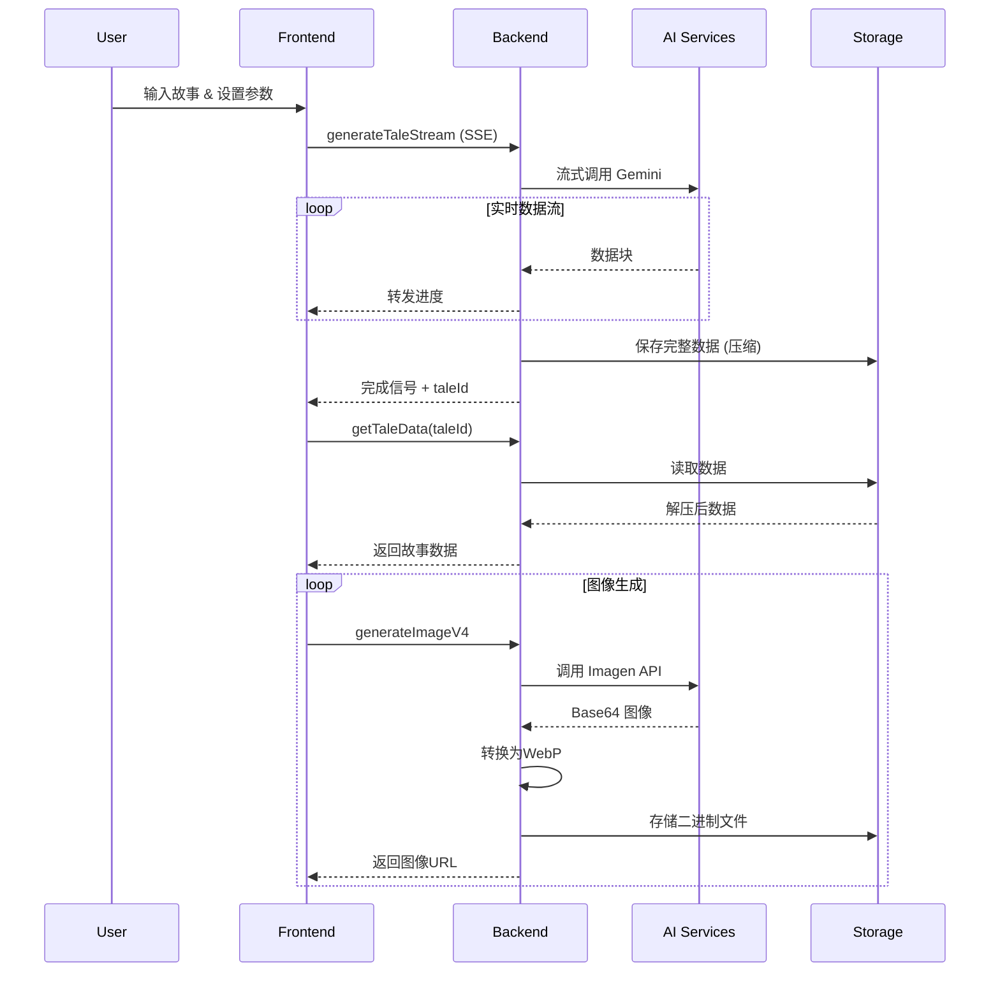

# Tale Draw - 系统设计文档

## 1. 核心架构

### 1.1 技术栈
- **前端**: React 19.1.0 (Create React App), JavaScript
- **后端**: Firebase Functions v2 (Node.js 22)
- **数据库/存储**: Cloud Storage (主), Firestore (备)
- **AI 服务**: Google Vertex AI (Gemini 2.5-flash, Imagen 3/4)
- **认证**: Firebase Authentication
- **图像处理**: Sharp 0.34.2 (WebP 转换和压缩)

### 1.2 系统架构图
```
┌─────────────────┐    ┌──────────────────┐    ┌─────────────────┐
│  React (UI)     │───▶│ Firebase Functions│───▶│ Google AI       │
│                 │    │                  │    │ (Gemini/Imagen) │
└─────────┬───────┘    └─────────┬────────┘    └─────────────────┘
          │                      │
          │                      ▼
┌─────────┴───────┐    ┌─────────────────────┐
│ Firebase Auth   │    │ Cloud Storage/      │
│                 │    │ Firebase Storage    │
└─────────────────┘    └─────────────────────┘
```

## 2. 数据流程与API设计

### 2.1 核心数据流


### 2.2 关键API接口

#### 前端API封装 (`client/src/api.js`)
- **`generateTaleStream(...)`**: 流式故事生成，建立SSE连接
- **`generateImageWithImagen(...)`**: 智能图像生成，支持Imagen 3/4

#### 后端Firebase Functions (`functions/index.js`)
- **`generateTaleStream` (HTTP)**: 流式调用Gemini，实时转发数据块
- **`getTaleData` (Callable)**: 从存储读取并解压故事数据
- **`generateImage/V4` (Callable)**: 调用Imagen API，WebP转换和存储

## 3. 数据结构

### 3.1 故事数据结构 (TaleData)
```json
{
  "storyTitle": "string",
  "artStyle": "string", 
  "storyAnalysis": {
    "totalLength": "string",
    "keyPlots": ["string"],
    "storyStructure": {
      "beginning": "string",
      "development": "string", 
      "climax": "string",
      "ending": "string"
    }
  },
  "allCharacters": {
    "characterName": {
      "appearance": "string",
      "clothing": "string",
      "personality": "string"
    }
  },
  "pages": [
    {
      "pageNumber": "number",
      "title": "string",
      "text": "string",
      "sceneType": "string",
      "sceneCharacters": ["string"],
      "imagePrompt": "string"
    }
  ]
}
```

### 3.2 前端状态管理
```javascript
{
  user: Object,           // Firebase认证用户
  story: "string",        // 用户输入故事
  pageCount: "number",    // 期望页数(1-30)
  aspectRatio: "string",  // 图像宽高比
  pages: [Object],        // 页面数据数组
  allCharacters: Object,  // 角色信息
  loading: "boolean",     // 加载状态
  logs: [Object],         // 操作日志
  isPaused: "boolean",    // 暂停状态
  abortController: "AbortController" // 中断控制器
}
```

## 4. 存储策略与数据优化

### 4.1 存储架构
- **主存储 (Cloud Storage)**:
  - 路径: `tales/{userId}/{taleId}.json.gz`
  - 格式: Gzip压缩JSON文件
  - 优点: 成本低，适合大对象
  
- **图像存储 (Firebase Storage)**:
  - 路径: `images/{userId}/{filename}.webp`
  - 格式: WebP二进制文件
  - 压缩: 90%质量，减少40-50%文件大小

### 4.2 图像数据流优化

**Base64处理策略**：
```javascript
// Imagen API返回Base64 → 立即转换为二进制
const imageBuffer = Buffer.from(base64Data, 'base64');

// Sharp处理二进制数据（不是Base64）
const compressedBuffer = await sharp(imageBuffer)
  .webp({ quality: 90, effort: 1 })
  .toBuffer();

// 存储压缩的二进制WebP文件
await file.save(compressedBuffer, {
  metadata: { contentType: 'image/webp' }
});
```

**优化效果**：
- Base64仅在API传输时短暂存在（数毫秒）
- 全程二进制处理，减少33%内存占用
- WebP格式减少40-50%存储空间

### 4.3 数据压缩策略
```javascript
// 智能压缩分析
static analyzeDataForCompression(taleData, jsonString) {
  const analysis = {
    totalSize: jsonString.length,
    dataType: 'text-with-urls', // 文本 + 图像URL
    shouldCompress: jsonString.length >= 1024,
    reason: 'pure-text-content'
  };
  return analysis;
}
```

## 5. 安全架构

### 5.1 安全日志系统

**环境检测**：
```javascript
// 前端
const isProduction = process.env.NODE_ENV === 'production';

// 后端
const isProduction = () => 
  process.env.NODE_ENV === 'production' || 
  process.env.GCLOUD_PROJECT !== undefined;
```

**安全日志级别**：

| 方法 | 开发环境 | 生产环境 | 使用场景 |
|------|----------|----------|----------|
| `safeLog.sensitive()` | ✅ 完整输出 | ❌ 不输出 | allCharacters等敏感数据 |
| `safeLog.debug()` | ✅ 完整输出 | ❌ 不输出 | 调试信息 |
| `safeLog.error()` | ✅ 完整输出 | 🔒 清理敏感数据 | 错误信息 |

**敏感数据识别**：
```javascript
const SENSITIVE_KEYS = [
  'allCharacters', 'password', 'token', 'apiKey', 
  'key', 'secret', 'credential', 'auth'
];
```

### 5.2 内容安全系统

**多层安全保护**：
1. **LLM层面**: Gemini自动内容过滤和友好转换
2. **提示词层面**: 前端实时安全词汇替换
3. **图像生成层面**: 安全过滤设置和负向提示词

**安全词汇转换**：
```javascript
const safetyReplacements = {
  '打架': '玩耍', '战斗': '友好竞赛', '愤怒': '专注',
  '可怕': '神秘', '恐怖': '有趣', '邪恶': '调皮',
  '危险': '冒险', '武器': '工具', '刀': '魔法棒'
};
```

**图像生成安全增强**：
```javascript
// 自动添加安全描述
const safetyPrompt = 'Safe and welcoming atmosphere, friendly expressions, suitable for children.';
```

## 6. 性能优化

### 6.1 流式处理架构
- **Server-Sent Events (SSE)**: 实时传输Gemini响应
- **内存优化**: 避免大对象在内存中停留
- **并发控制**: 图片生成串行处理，避免API限制

### 6.2 Firebase Functions配置

| 函数名称 | 内存配置 | 超时配置 | 配置理由 |
|---------|----------|----------|----------|
| `generateTaleStream` | 1GB | 300s | 流式处理，I/O密集 |
| `generateImageV4` | 1GB | 300s | Imagen API + Sharp处理 |
| `getTaleData` | 256MB | 60s | 数据读取操作 |
| `healthCheck` | 128MB | 60s | 轻量级检查 |

### 6.3 错误处理与重试
```javascript
// 指数退避重试机制
async function retryWithBackoff(operation, maxRetries = 3) {
  for (let i = 0; i < maxRetries; i++) {
    try {
      return await operation();
    } catch (error) {
      if (i === maxRetries - 1) throw error;
      await new Promise(resolve => 
        setTimeout(resolve, Math.pow(2, i) * 1000)
      );
    }
  }
}
```

## 7. 状态管理与持久化

### 7.1 状态持久化系统
```javascript
class StateManager {
  // 状态数据结构
  static CURRENT_VERSION = "1.0.0";
  static EXPIRY_HOURS = 24;
  
  // 自动保存关键节点
  saveState(stateData) {
    const data = {
      version: StateManager.CURRENT_VERSION,
      timestamp: Date.now(),
      userEmail: user.email,
      ...stateData
    };
    localStorage.setItem(key, JSON.stringify(data));
  }
  
  // 智能恢复流程
  async restoreState(user) {
    // 验证数据有效性和用户身份
    // 恢复基本状态 + 重新下载图片
  }
}
```

### 7.2 图片重新下载机制
- 页面刷新后自动重新下载所有图片（非重新生成）
- 实时显示下载进度和状态
- 支持失败重试和状态标记

## 8. 导出功能设计

### 8.1 HTML导出
**离线查看支持**：
```javascript
// Base64嵌入策略（仅用于HTML导出）
async function exportToHTML(taleData) {
  for (const page of taleData.pages) {
    // 从二进制WebP → 临时Base64 → HTML嵌入
    const webpBuffer = await downloadFromStorage(page.image);
    const base64ForEmbed = webpBuffer.toString('base64');
    const htmlImg = ``;
    // 用完即丢，不持久化
  }
}
```

### 8.2 PPTX导出
**智能布局系统**：
- 实际图片比例检测
- 动态图文布局调整
- 自适应字体大小
- 保持原始长宽比

## 9. 监控与维护

### 9.1 关键监控指标
```javascript
const metrics = {
  base64InputSize: base64Data.length,
  binaryOutputSize: binaryData.length,
  compressionRatio: calculateRatio(base64Data, binaryData),
  processingTime: endTime - startTime,
  memoryUsage: process.memoryUsage(),
  errorRate: errorCount / totalRequests
};
```

### 9.2 成本优化
- **调用次数**: 免费层125万次/月
- **Imagen API**: Imagen 3 ~$0.02/张, Imagen 4 ~$0.04/张
- **存储成本**: WebP格式减少60-70%

## 10. 技术债务与未来优化

### 10.1 已完成优化
- ✅ WebP图像格式优化 (60-70%减少)
- ✅ 流式处理架构统一
- ✅ HTML导出Base64嵌入修复
- ✅ 安全日志系统实现
- ✅ 状态持久化系统

### 10.2 架构优势
- **最小化Base64生命周期**: 仅在API接收阶段短暂存在
- **全程二进制架构**: 最优的存储和传输性能
- **清晰数据分离**: 图像二进制化，文本纯文本化
- **按需转换**: 只在特定场景（HTML导出）临时转换

---

*文档版本: v3.0*  
*最后更新: 2025-07-09*  
*维护者: Tale Draw 开发团队* 