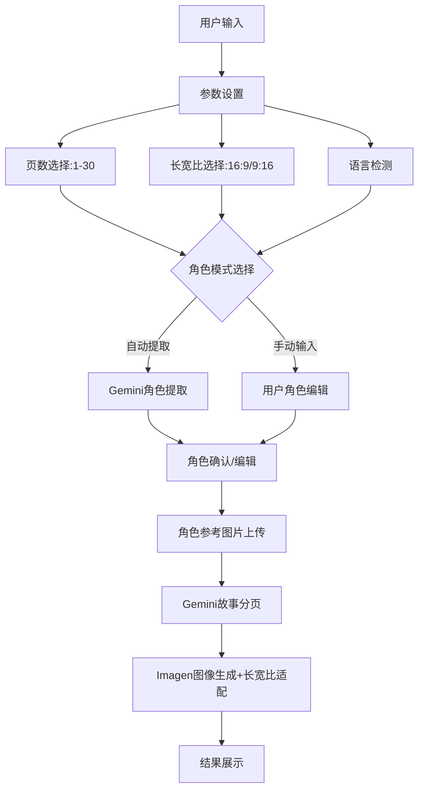

# 📚 Tale Draw - 开发计划文档

## 项目概述

基于Gemini和Imagen 4 API开发的自动绘制故事书React应用。用户输入故事文本，系统自动生成多页插图故事书。

## 🎯 核心功能需求

### 基础功能
- [x] 用户故事文本输入
- [x] 使用Gemini生成图像提示词（JSON格式）
- [x] 使用Imagen 4生成每页插图
- [x] 可滚动的故事书展示界面
- [x] 用户可配置页数（默认7页）
- [x] 图片长宽比选择（16:9/9:16）
- [ ] 多语言支持（与输入文本相同语言）

### 角色一致性功能
- [ ] 角色智能提取系统（自动从故事中识别角色）
- [ ] 角色手动输入系统（用户自定义角色）
- [ ] 角色外观一致性保持
- [ ] 角色参考图片上传（可选）
- [ ] 基于参考图片的图像生成

### 技术架构
- [x] React单页应用
- [x] Firebase Authentication（邮箱/密码）
- [x] Firebase Storage图像存储
- [x] Firebase Functions作为API代理
- [x] 最新Imagen 4 API集成

---

## 🏗️ 开发阶段规划

## Phase 1: 基础架构完善 ✅

### 1.1 项目初始化
- [x] React应用搭建
- [x] Firebase项目配置
- [x] 环境变量设置
- [x] 依赖包安装

### 1.2 Firebase集成
- [x] Firebase SDK配置
- [x] Authentication系统实现
- [x] Storage配置
- [x] Functions部署

### 1.3 API集成
- [x] Gemini API接入
- [x] Imagen 4 API接入
- [x] CORS问题解决
- [x] 错误处理机制

**状态**: ✅ 已完成

---

## Phase 2: UI界面增强 ✅

### 2.1 输入界面优化
- [x] **页数选择器组件**
  - ✅ 滑块或数字输入框
  - ✅ 范围：1-30页
  - ✅ 默认值：7页
  - ✅ 智能页数建议提示
  
- [x] **图片设置区域**
  - ✅ 长宽比选择器组件（16:9 / 9:16切换，默认16:9）
  - ✅ 实时预览不同比例的效果示意
  - ✅ 适配移动端显示优化
  - ✅ 与Imagen 4 API参数对接
  
- [ ] **角色管理区域**
  - 角色提取模式选择（自动提取 / 手动输入）
  - 自动提取：显示识别出的角色列表，允许编辑
  - 手动输入：角色名称、描述、角色参考图片上传
  - 角色预览和编辑功能

### 2.2 表单结构重构
```jsx
// 新的输入数据结构
{
      storyText: string,           // 故事内容（最大2000字）
    pageCount: number,           // 页数（1-30，默认6）
  aspectRatio: string,         // 图片长宽比："16:9" | "9:16"，默认"16:9"
  language: string,            // 自动检测输入语言
  characterMode: string,       // 角色模式："auto" | "manual"
  characters: [                // 角色信息数组
    {
      id: string,              // 角色唯一ID
      name: string,            // 角色名称
      description: string,     // 角色描述
      isAutoGenerated: boolean, // 是否自动生成
      referenceImage: File,    // 角色参考图片（可选）
      seed: number             // 角色一致性种子值
    }
  ]
}
```

### 2.3 UI/UX改进
- [ ] 响应式设计优化
- [ ] 加载动画和进度指示器
- [ ] 错误提示优化
- [ ] 多语言界面支持

**预计时间**: 2-3天

---

## Phase 2.5: 角色智能系统 🎭

### 2.5.1 角色提取算法
- [ ] **Gemini角色识别API**
  ```javascript
  // 角色提取服务
  async function extractCharacters(storyText, language) {
    const prompt = `
    分析以下故事，提取主要角色信息：
    故事：${storyText}
    
    要求：
    1. 识别2-5个主要角色
    2. 为每个角色生成详细外观描述
    3. 包含年龄、性别、外貌特征、服装等
    4. 确保描述一致性和可视化
    
    返回JSON：
    {
      "characters": [
        {
          "name": "角色名",
          "description": "详细外观描述",
          "traits": ["特征1", "特征2"],
          "age": "年龄组",
          "role": "故事角色"
        }
      ]
    }
    `;
  }
  ```

### 2.5.2 角色管理界面
- [ ] **模式选择组件**
  - 自动提取 vs 手动输入切换
  - 预览提取结果
  - 编辑和确认功能

- [ ] **角色编辑器**
  - 角色卡片展示
  - 在线编辑描述
  - 参考图片上传
  - 一致性预览

### 2.5.3 角色一致性算法
- [ ] **种子值生成**
  ```javascript
  // 为每个角色生成唯一但稳定的种子值
  function generateCharacterSeed(characterName, traits) {
    const hash = cyrb53(characterName + traits.join(''));
    return Math.abs(hash) % 1000000;
  }
  ```

- [ ] **提示词增强**
  ```javascript
  // 角色一致性提示词构建器
  function buildCharacterPrompt(character, scene, pageNumber) {
    return `
    角色：${character.name}
    外观：${character.description}
    特征：${character.traits.join(', ')}
    场景：${scene}
    种子值：${character.seed}
    风格：儿童绘本插图，一致性角色设计
    `;
  }
  ```

**预计时间**: 3-4天

---

## Phase 3: 后端API增强 🔄

### 3.1 Gemini API升级
- [ ] **角色提取API**
  ```javascript
  const characterExtractionPrompt = `
  请从以下故事中提取主要角色信息：
  
  故事内容：${storyText}
  
  要求：
  1. 识别所有主要角色
  2. 为每个角色生成详细的外观描述
  3. 确保描述足够详细以保持视觉一致性
  4. 使用${language}语言
  
  返回JSON格式的角色列表...
  `;
  ```

- [ ] **故事分页API**
  ```javascript
  const storyPaginationPrompt = `
  请将以下故事分解为${pageCount}页的儿童绘本：
  
  故事内容：${storyText}
  角色信息：${charactersInfo}
  
  要求：
  1. 每页包含适量文本（适合儿童阅读）
  2. 生成详细的图像描述
  3. 保持角色外观一致性
  4. 使用${language}语言
  
  返回JSON格式...
  `;
  ```

- [ ] **JSON响应格式优化**
  ```json
  {
    "totalPages": 10,
    "language": "zh-CN",
    "characters": {
      "小猫咪咪": {
        "description": "穿红裙子的可爱小猫",
        "traits": ["红色裙子", "大眼睛", "白色毛发"]
      }
    },
    "pages": [
      {
        "pageNumber": 1,
        "text": "故事文本",
        "imagePrompt": "详细图像描述",
        "characters": ["小猫咪咪"],
        "scene": "花园",
        "mood": "开心"
      }
    ]
  }
  ```

### 3.2 Imagen 4 API增强
- [ ] **参考图片支持**
  ```javascript
  // 支持参考图片和动态长宽比的API调用
  const requestBody = {
    instances: [{
      prompt: enhancedPrompt,
      image: referenceImageBase64 // 新增：参考图片
    }],
    parameters: {
      sampleCount: 1,
      aspectRatio: userAspectRatio, // 用户选择的长宽比："16:9" | "9:16"
      seed: characterSeed, // 角色一致性种子
      addWatermark: false,
      referenceImageConfig: {
        referenceType: "SUBJECT" // 参考类型：SUBJECT或STYLE
      }
    }
  };
  ```

- [ ] **长宽比适配优化**
  ```javascript
  // 根据长宽比优化提示词
  function optimizePromptForAspectRatio(basePrompt, aspectRatio) {
    const aspectRatioHints = {
      "16:9": "horizontal composition, landscape orientation, wide scene",
      "9:16": "vertical composition, portrait orientation, tall scene"
    };
    
    return `${basePrompt}. ${aspectRatioHints[aspectRatio]}, children's book illustration style.`;
  }
  ```

### 3.3 Firebase Functions更新
- [ ] 参考图片处理函数
- [ ] 角色一致性算法
- [ ] 长宽比参数传递和处理
- [ ] 批量图像生成优化
- [ ] 不同比例的图像质量优化

**预计时间**: 3-4天

---

## Phase 4: 角色一致性系统 🎭

### 4.1 角色管理器
```javascript
class CharacterManager {
  constructor(characters) {
    this.characters = characters;
    this.seeds = new Map(); // 角色种子值
    this.referenceImages = new Map(); // 参考图片
  }
  
  // 上传角色参考图片
  async uploadReferenceImages() { }
  
  // 生成角色一致性提示词
  getCharacterPrompt(characterName, scene) { }
  
  // 获取角色专用种子值
  getCharacterSeed(characterName) { }
}
```

### 4.2 提示词增强系统
- [ ] **角色外观描述生成器**
- [ ] **场景与角色结合算法**
- [ ] **风格一致性保持机制**

### 4.3 图像质量优化
- [ ] 参考图片预处理
- [ ] 提示词优化算法
- [ ] 生成结果质量评估

**预计时间**: 4-5天

---

## Phase 5: 用户体验优化 ✨

### 5.1 生成流程优化
- [ ] **智能页数建议**（根据故事长度）
- [ ] **实时生成预览**
- [ ] **生成进度可视化**
- [ ] **错误重试机制**

### 5.2 多语言支持
- [ ] **自动语言检测**
- [ ] **多语言提示词模板**
- [ ] **界面多语言切换**

### 5.3 存储和分享
- [ ] **故事书保存功能**
- [ ] **PDF导出功能**
- [ ] **社交分享集成**
- [ ] **历史记录管理**

**预计时间**: 3-4天

---

## Phase 6: 测试和部署 🚀

### 6.1 功能测试
- [ ] 单元测试编写
- [ ] 集成测试
- [ ] 用户体验测试
- [ ] 性能测试

### 6.2 优化和调试
- [ ] API调用优化
- [ ] 图像加载性能优化
- [ ] 错误处理完善
- [ ] 用户反馈收集

### 6.3 部署上线
- [ ] 生产环境配置
- [ ] Firebase Hosting部署
- [ ] 域名和SSL配置
- [ ] 监控和日志配置

**预计时间**: 2-3天

---

## 📊 技术实现细节

### 核心组件架构
```
src/
├── components/
│   ├── StoryInput.js          // 故事输入组件
│   ├── PageSelector.js        // 页数选择器（新增）
│   ├── AspectRatioSelector.js // 长宽比选择器（新增）
│   ├── CharacterManager.js    // 角色管理器（新增）
│   ├── CharacterExtractor.js  // 自动角色提取（新增）
│   ├── CharacterEditor.js     // 角色编辑器（新增）
│   ├── StoryBook.js           // 故事书展示
│   └── ProgressIndicator.js   // 进度指示器
├── services/
│   ├── geminiService.js       // Gemini API服务
│   ├── imagenService.js       // Imagen 4 API服务
│   ├── characterService.js    // 角色管理服务（新增）
│   └── storageService.js      // 存储服务
├── utils/
│   ├── languageDetector.js    // 语言检测（新增）
│   ├── promptBuilder.js       // 提示词构建器（新增）
│   └── imageProcessor.js      // 图像处理（新增）
└── hooks/
    ├── useCharacterManager.js // 角色管理Hook（新增）
    └── useStoryGeneration.js  // 故事生成Hook
```

### API调用流程


---

## 🎯 当前优先级

### 🔥 高优先级（立即开始）
1. ✅ **页数选择器实现**（1-30页，默认6页）
2. ✅ **长宽比选择器实现**（16:9/9:16，默认16:9）
3. **角色管理系统设计**
4. **角色提取vs手动输入UI**
5. **Gemini角色提取API**

### ⚡ 中优先级（本周完成）
1. **参考图片上传功能**
2. **角色一致性算法**
3. **多语言支持**

### 💡 低优先级（下周计划）
1. **高级UI优化**
2. **导出分享功能**
3. **性能优化**

---

## 📈 成功指标

- [ ] 用户可以成功配置1-30页的故事
- [ ] 用户可以选择16:9或9:16长宽比
- [ ] 系统能自动提取2-5个主要角色
- [ ] 角色在所有页面保持外观一致性（一致性评分 > 90%）
- [ ] 用户可以选择自动提取或手动输入角色
- [ ] 不同长宽比的图像构图优化效果明显
- [ ] 支持至少3种语言（中文、英文、日文）
- [ ] 图像生成成功率 > 95%
- [ ] 角色识别准确率 > 85%
- [ ] 页面加载时间 < 3秒
- [ ] 移动端完美适配（自动适应长宽比）

---

## 🔄 下一步行动

✅ **已完成**: Phase 2.1 - UI界面增强
- ✅ 页数选择器组件（1-30页，默认6页）
- ✅ 长宽比选择器组件（16:9/9:16，默认16:9）
- ✅ 响应式设计和现代化UI
- ✅ API集成和参数传递

**立即开始**: Phase 2.5 - 角色智能系统
- 开发Gemini角色提取API
- 创建角色模式选择界面
- 实现角色管理器组件
- 实现角色编辑器

**本周目标**: 完成角色管理系统，实现角色一致性
**下周目标**: 测试完整流程，优化用户体验

---

## 📝 最新功能更新

### ✅ 自动标题生成功能 (2025-01-01)

**功能描述**: LLM自动为故事生成吸引人的标题，替换固定的"您的故事绘本"显示。

**技术实现**:
- 服务端：在generateStoryPages函数中添加第四步"标题创作"
- 标题生成要求：体现故事核心主题、适合儿童绘本、与输入语言一致
- 返回结构：新增`storyTitle`字段
- 客户端：接收并显示自动生成的故事标题

**用户体验**:
- 每个故事都有独特的标题，增强个人化体验
- 标题与故事内容高度匹配，提升专业感
- 支持多语言标题生成，保持语言一致性

**接口变更**:
```javascript
// 返回数据结构更新
{
  storyTitle: string,        // 新增：自动生成的故事标题
  pages: Array,              // 生成的页面数组
  pageCount: number,         // 实际生成的页数
  mainCharacter: string,     // 主角描述
  characterType: string,     // 角色类型
  success: boolean,          // 生成是否成功
  generatedAt: string        // 生成时间戳
}
```

### ✅ 输入限制和Token优化 (2025-01-01)

**输入限制功能**:
- 2000字硬限制，超出自动截断
- 实时字数计数器（灰色→橙色→红色渐变提示）
- 智能提示系统（1500字提醒，1800字警告）

**Token优化**:
- 故事分页生成：4,000 → 8,000 tokens (提升100%)
- 角色提取功能：1,000 → 2,000 tokens (提升100%)
- 支持更长故事和30页绘本

**技术规格**:
- 中文字符与Token比例优化 (约1.5:1)
- 完美匹配Gemini 2.0 Flash的8k输出能力
- 支持短篇(6-10页)、中篇(10-20页)、长篇(20-30页)绘本

---

*最后更新: 2025-01-01*
*状态: Phase 1 ✅ 已完成，Phase 2.1 ✅ 已完成，标题生成 ✅ 已完成，输入优化 ✅ 已完成* 